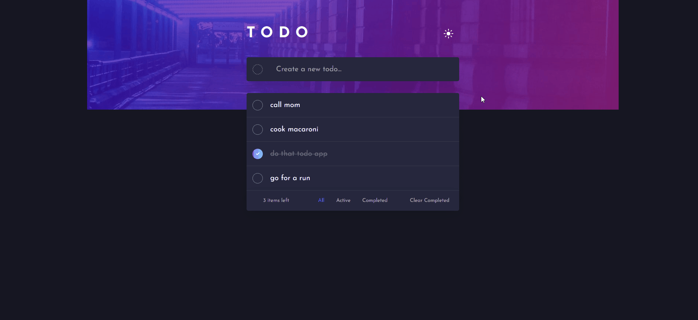

# Frontend Mentor - Todo app solution

This is a solution to the [Todo app challenge on Frontend Mentor](https://www.frontendmentor.io/challenges/todo-app-Su1_KokOW). Frontend Mentor challenges help you improve your coding skills by building realistic projects.

## Table of contents

- [Overview](#overview)
  - [The challenge](#the-challenge)
  - [Screenshot](#screenshot)
  - [Links](#links)
  <!-- - [My process](#my-process) -->
  - [Built with](#built-with)
  - [What I learned](#what-i-learned)
  - [Continued development](#continued-development)
  <!-- - [Useful resources](#useful-resources) -->
- [Author](#author)
<!-- - [Acknowledgments](#acknowledgments) -->

<!-- **Note: Delete this note and update the table of contents based on what sections you keep.** -->

## Overview

After several small projects and mini games made with javascript this todo app was my escape from the tutorials phase.

### The challenge

Users should be able to:

- View the optimal layout for the app depending on their device's screen size
- See hover states for all interactive elements on the page
- Add new todos to the list
- Mark todos as complete
- Delete todos from the list
- Filter by all/active/complete todos
- Clear all completed todos
- Toggle light and dark mode
- **Bonus**: Drag and drop to reorder items on the list

### Screenshot

### Links

- Solution URL: [FrontEnd](https://www.frontendmentor.io/solutions/todo-app-js-and-scss-64YOAWbOQ)
- Live Site URL: [Netlify](https://todo-app-main.netlify.app/)

<!-- ## My process -->

### Built with

- Semantic HTML5 markup
- CSS custom properties
- Flexbox
- Javascript

<!-- **Note: These are just examples. Delete this note and replace the list above with your own choices** -->

### What I learned

I managed to implement fundamentals such as looping arrays, the switch statement, aswell as get a taste of adding, deleting and styling elements through js.

### Continued development

On my next challenges I want to focus on writing cleaner javascript. This time I have only focused on getting the app to work leaving aside good code structure or best practices.

<!-- ### Useful resources

- [Example resource 1](https://www.example.com) - This helped me for XYZ reason. I really liked this pattern and will use it going forward.
- [Example resource 2](https://www.example.com) - This is an amazing article which helped me finally understand XYZ. I'd recommend it to anyone still  -->

## Author

<!-- - Website - [Add your name here](https://www.your-site.com) -->

- Frontend Mentor - [@popescudragos](https://www.frontendmentor.io/profile/popescudragos)
- LinkedIn - [@ospop](https://www.linkedin.com/in/ospop/)
  <!-- - Twitter - [@yourusername](https://www.twitter.com/yourusername) -->
  <!-- ## Acknowledgments -->
